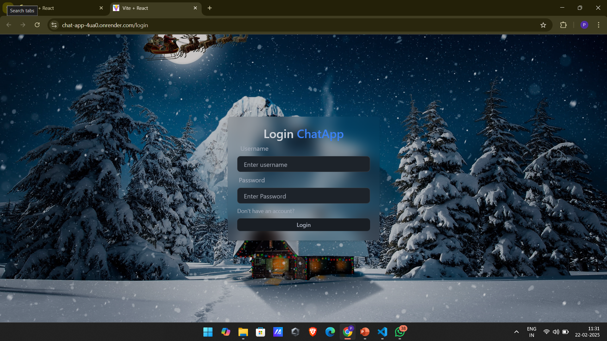
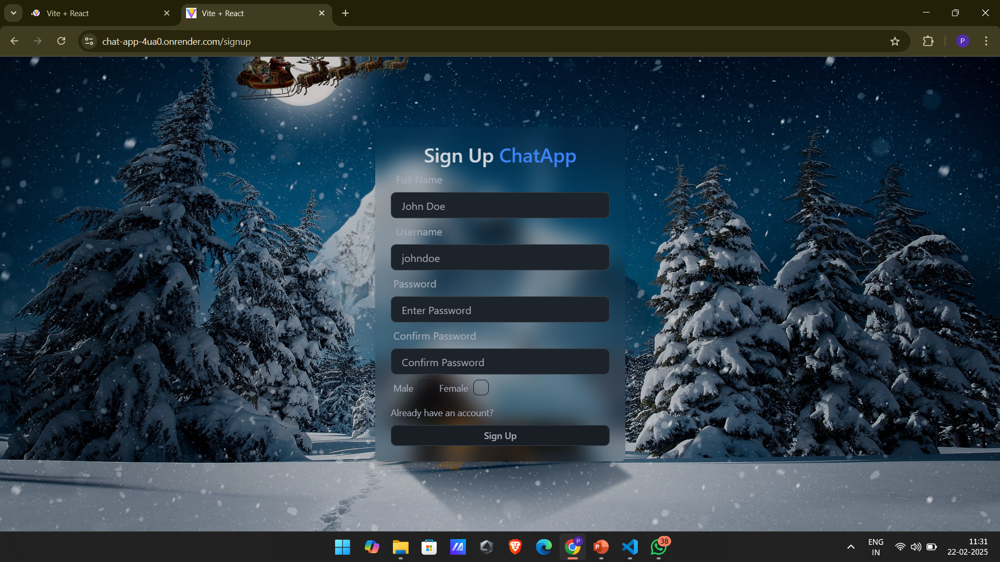
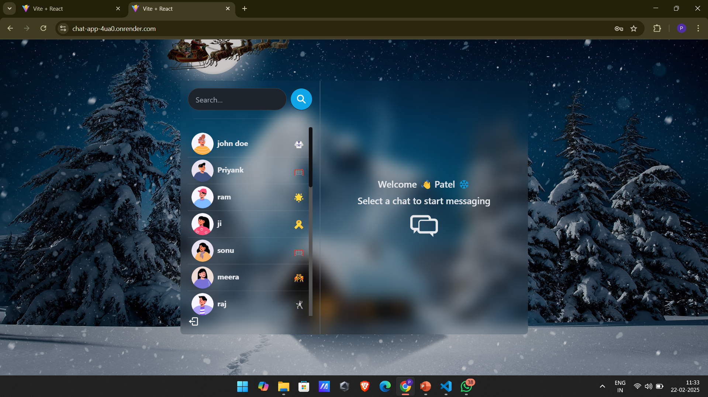
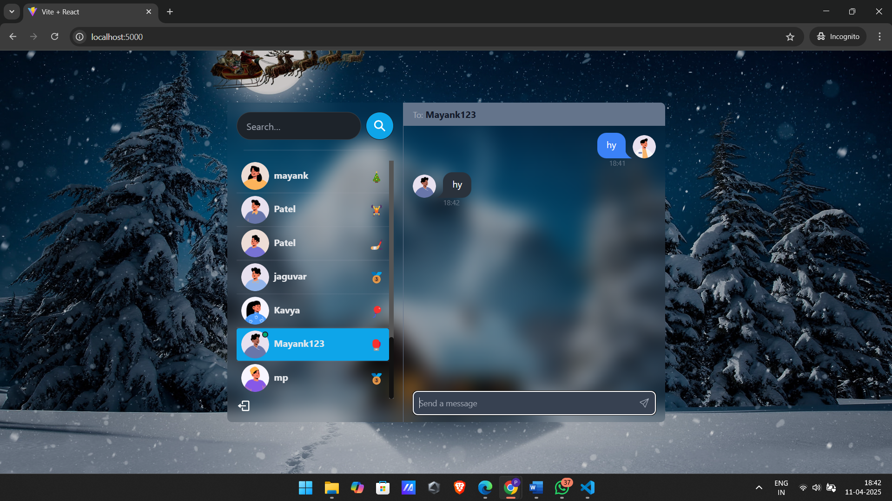

# 💬 Realtime Chat App

A full-stack **MERN** Chat Application with **Socket.IO** for realtime messaging. Users can send messages instantly, see who's online, and enjoy a clean modern UI.

---

## 🚀 Features

- Real-time messaging with Socket.IO
- 1-on-1 chats
- User authentication (JWT)
- Responsive UI with Tailwind CSS
- MongoDB for storing user and chat data

---

## 🛠️ Tech Stack

**Client:** React, Tailwind CSS, Axios  
**Server:** Node.js, Express.js, MongoDB, Socket.IO  
**Database:** MongoDB (Mongoose)  
**Auth:** JWT (JSON Web Tokens)

---

## 📸 Screenshots

| Login Page | Sign Up Page |
|------------|-----------|
|  |  |
| chat room | chat room |
|------------|-----------|
|  |  |

---

## ⚙️ Installation

### Clone the repo

```bash
git clone https://github.com/DadagaMayank/chat-app.git
cd chat-app
